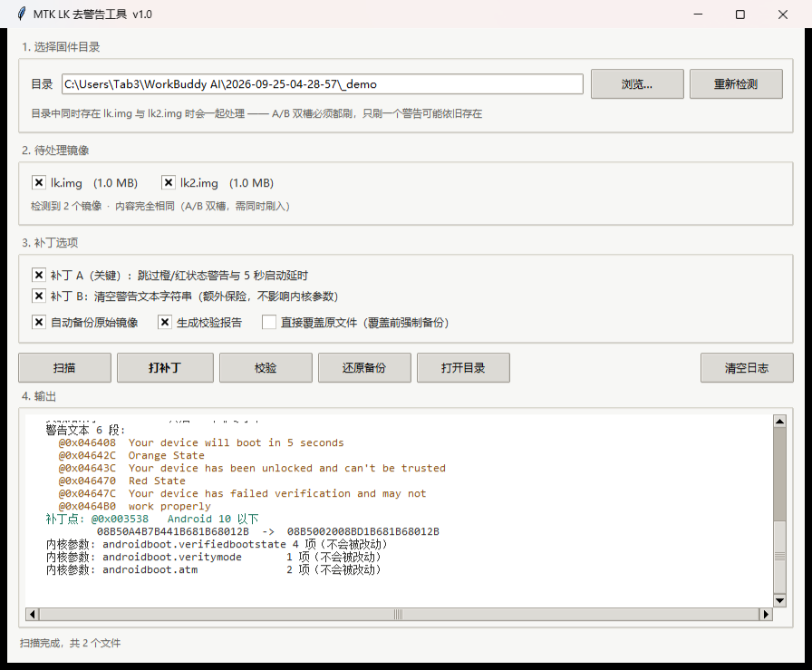

# MTK LK Warning Patch

English | [中文](README.zh-CN.md)

[](LICENSE)
[]()

Remove the **Orange State / Red State / dm-verity** boot warnings and the 5-second boot delay
from MediaTek (MTK) `lk.img` / `lk.bin` images — with a GUI, automatic verification, and a
one-click rollback.



> Based on the Hovatek guide: <https://www.hovatek.com/forum/thread-31664.html>

---

## Why this tool exists

The original guide asks you to do everything by hand in HxD: search a byte pattern, eyeball
whether the 4 bytes before it are `08B5`, zero out a range of ASCII strings, hope you didn't
touch the kernel command line. That is slow and easy to get wrong.

Worse, the guide treats "hide the warning text" and "remove the 5 second delay" as two
separate tricks. **They are not.** Disassembling the LK reveals that the function behind the
delay pattern is actually the *warning dispatcher*:

| `boot state` | original behaviour |
|---|---|
| `1` (orange) | prints 3 lines of warning → `mdelay(5000)` |
| `2` / `3` (red) | prints 4 lines of warning → `mdelay(5000)` → `return -1` |
| `0` (green) | `return 0`, no warning |

Patching that function to `return 0` kills **both** the warning text and the 5 second wait in
one shot. For an orange-state device the control flow is otherwise *identical* to stock
(`sub_348C` already returned `0`), so the change is very low risk.

## What it does

**Patch A — the important one.** Locates the dispatcher via the documented signature
(`7B441B681B68012B` on Android < 10, `7B441B681B68022B` on Android >= 10, and requires the
preceding 4 bytes to be `08B5????`) and rewrites its prologue:

```
08 B5 0A 4B 7B 44 1B 68 1B 68 01 2B     before
08 B5 00 20 08 BD 1B 68 1B 68 01 2B     after   (push {r3,lr}; movs r0,#0; pop {r3,pc})
```

**Patch B — belt and braces.** Zeroes the warning text strings so nothing can print them,
while leaving `androidboot.verifiedbootstate=*`, `androidboot.veritymode=*` and
`androidboot.atm=*` completely untouched — those are kernel command line arguments and
breaking them would be bad.

**Every run is verified.** The tool reports the exact diff ranges, re-checks the kernel
parameters, counts any residual warning strings, confirms the LK header is unchanged, and
disassembles the patched prologue so you can see `movs r0, #0` with your own eyes.

## Usage

Download `LKTool.exe` from [Releases](../../releases) and run it. No Python required.

1. Pick the firmware folder (e.g. a GeekFlashTool readback directory)
2. The tool auto-detects `lk.img` + `lk2.img` and ticks both
3. **Scan** to preview, **Patch** to apply, **Verify** / **Restore backup** as needed

> ### Flashing
> `lk` and `lk2` are the A/B slots. **Flash both** — if you only flash one, the device may
> boot from the other slot and the warning will still be there. The tool prints this reminder
> after every patch for exactly that reason.
>
> In SP Flash Tool: load the scatter file, point `lk` and `lk2` at the patched images, and use
> **Download Only** (never *Format All + Download*).
>
> If a `.........` counter still shows up on a black screen, flash with `fastboot` instead:
> `fastboot flash lk lk_patched.img`

### Command line

```
LKTool.exe --cli <lk.img> [--delay-only] [--inplace]

  --delay-only   apply patch A only, leave the strings alone
  --inplace      overwrite the original file (a backup is still made first)
```

Passing a file path also enters CLI mode automatically.

## Output files

| File | Meaning |
|---|---|
| `lk_original_backup.img` | untouched copy of the original, created before any change |
| `lk_patched.img` | patch result (default — the original is left alone) |
| `lk.img` | overwritten in place, only if you tick that option |

## Building from source

Requires Python 3.10+ **with tkinter**, and `capstone` (optional — only used for the
disassembly display; the tool degrades gracefully without it).

```
pip install capstone
python LKTool.py            # run from source
build_exe.bat               # build the single-file exe with PyInstaller
```

### Layout

```
LKTool.py      entry point (GUI / CLI dispatch)
lk_gui.py      tkinter interface
lk_core.py     scanning / patching / verification core — no GUI dependency, importable
build_exe.bat  PyInstaller build script
```

`lk_core.py` has no dependencies beyond the standard library, so you can drive it from your
own scripts:

```python
import lk_core

data = lk_core.read_file('lk.img')
print(lk_core.scan(data)['patch_a'])      # locate the dispatcher
new, log = lk_core.apply(data)            # patch A + B
lk_core.write_file('lk_patched.img', new)
```

## Notes on the LK image format

Measured on an MT6739 image, useful if you want to extend this:

```
0x000000-0x0001FF   header: magic 0x58881688 | size (u32 @0x04) | name[12] @0x08 ("lk")
                            ext_magic 0x58891689 @0x30
0x000200-...        payload (length = size field)
tail                zero padding up to the partition size (1 MB)
                    no appended signature block, no checksum field in the header
```

The image uses **PC-relative addressing with a relative literal pool**, so you will *not* find
absolute pointers to the warning strings. Code looks like:

```asm
ldr r3, [pc, #0x28]   ; literal holds an offset, not an address
add r3, pc            ; r3 = literal + (this instruction's address + 4)
ldr r3, [r3]
```

Resolve targets with `target_offset = literal + address_of_add + 4`.

## Limitations

- The GUI is currently **Chinese only**. Adding an English translation would be a welcome
  contribution — the strings live in `lk_gui.py`.
- Only tested against MT6739 / Android 9-era LK images so far. The scanner will refuse to
  patch anything whose signature it cannot find, so it should fail safe on other devices, but
  reports from other SoCs are welcome.
- Patch B only matters if some other code path prints those strings; patch A alone is usually
  sufficient.

## Credits

- The original method: [Hovatek — Remove orange / red state warning on MTK](https://www.hovatek.com/forum/thread-31664.html)
- Capstone for the disassembly engine

## License

MIT — see [LICENSE](LICENSE).

Flashing a modified bootloader is done at your own risk. Always keep the backup the tool
creates, and make sure you know how to recover the device before you start.
